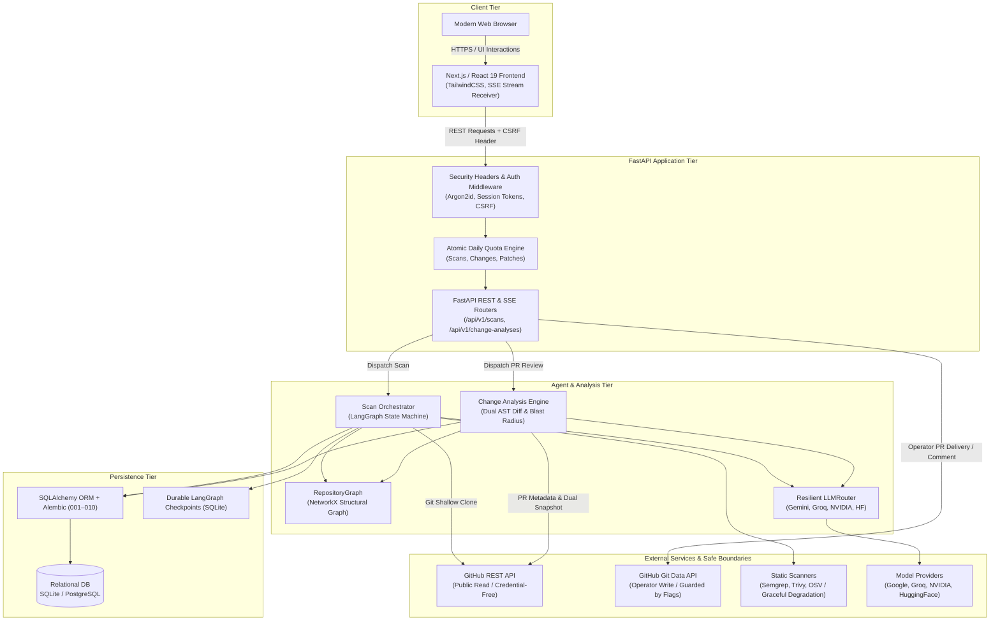
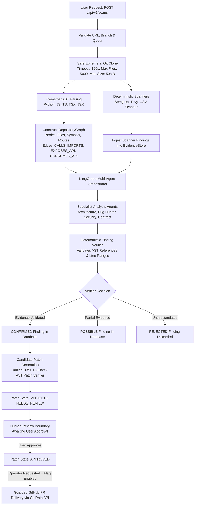
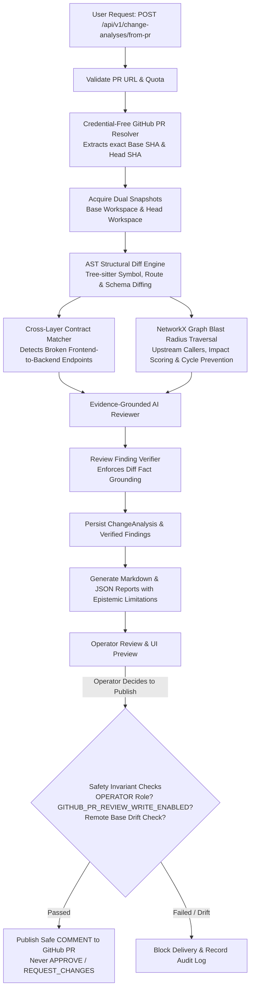

# RepoLens Architecture Specification

> **Version**: 1.0.0 (Phase 9)  
> **Status**: Release-Ready v1.0.0 Build  
> **Audience**: Systems Engineers, Architects, Technical Reviewers

---

## 1. System Purpose

**RepoLens** is an evidence-first repository and pull-request intelligence platform. It combines deterministic structural static analysis, cross-layer dependency graph traversal, and evidence-grounded agentic reasoning to inspect multi-language codebases, verify candidate security remediations, and analyze the blast radius of pull requests.

RepoLens treats all submitted codebases as untrusted data, enforcing strict containment boundaries, tenant isolation, human authorization gates, and guarded GitHub API writes.

---

## 2. Design Principles

1. **Deterministic Evidence Precedes Model Reasoning**: Structural AST parsing (Tree-sitter), static vulnerability analysis (Semgrep, Trivy, OSV), and dependency graph modeling execute prior to agentic reasoning. Models reason only over verified machine facts.
2. **Untrusted Repository Confinement**: Submitted repositories are passive data. RepoLens never executes arbitrary repository code, never runs test suites, never imports dynamic reflection modules, and never triggers external build scripts or Makefiles.
3. **Cross-Layer Contract Parity**: Frontend HTTP client calls, backend API routes, Pydantic schemas, database models, and migration steps are cross-referenced across architectural boundaries to detect contract breaks.
4. **Guarded GitHub Boundaries**: Public repository and PR analyses operate credential-free. Remote GitHub writes require server `GITHUB_TOKEN`, `OPERATOR` privileges, resource ownership, human approval, explicit feature flags, and remote branch drift checks.
5. **Human-in-the-Loop Authority**: Remediation patches pause at human approval boundaries (`VERIFIED` / `NEEDS_REVIEW`). Machine systems never mark patches as `APPROVED`.
6. **Zero External Worker Overhead**: Operates entirely in-process without requiring external daemon infrastructure such as Docker, Redis, Celery, or Kafka for local execution.

---

## 3. High-Level Architecture

RepoLens consists of a Next.js frontend communicating over typed REST and Server-Sent Events (SSE) with a FastAPI backend. Workflow orchestration is governed by LangGraph state machines, persisting execution state into SQLAlchemy relational models (SQLite by default, PostgreSQL compatible).

### System Context Diagram

---

## 4. Repository Scan Pipeline

The scan pipeline ingests a public GitHub repository, enforces resource budgets, extracts deterministic AST symbols and static scanner findings, constructs a structural graph, invokes specialist agents, and produces verified findings with candidate remediation patches.

### Scan Pipeline Diagram

---

## 5. PR & Change-Analysis Pipeline

The change analysis pipeline assesses the structural and contract blast radius between two repository revisions or from a public GitHub pull request without requiring credentials.

### PR Review Pipeline Diagram

---

## 6. Evidence Model

RepoLens treats findings as unverified hypotheses until backed by deterministic machine facts.

- **`EvidenceStore` / `EvidenceRegistry`**: Central registry recording exact repository files, 40-character commit SHAs, line numbers, symbol names, and scanner diagnostic outputs.
- **Evidence Verification Rules**:
  - Every finding must cite a valid file and line span present in the scanned snapshot.
  - AST symbol claims must resolve to actual syntax nodes parsed by Tree-sitter.
  - Cross-layer contract breaks must show the explicit producer route definition and consumer client invocation.
  - LLM hallucinations (referencing non-existent files, inventing phantom routes, or misquoting line numbers) are rejected by the finding verifier.

---

## 7. Agent Workflow Architecture

Workflow execution is driven by **LangGraph** state machines with typed state dictionaries:

- **Strict State Schema**: State carries immutable identifiers (`scan_id`, `repository_id`, `commit_sha`), collected evidence, candidate findings, and verification statuses.
- **Deterministic vs Reasoning Nodes**:
  - *Deterministic Nodes*: File ingestion, Tree-sitter parsing, scanner execution, graph traversal, diff calculation, patch validation, and drift checking.
  - *LLM Reasoning Nodes*: Root-cause explanation, multi-file synthesis, architectural summarization, fix strategy generation, and PR review comments.
- **Termination Guarantees**: State graphs have bounded iteration counts, explicit error edges, and graceful exit conditions to prevent infinite execution loops.
- **Durable Checkpointing**: Intermediate graph checkpoints are written to `checkpoints.db`, allowing crash recovery and inspection.

---

## 8. Data Model & Migrations

Persistence is managed with **SQLAlchemy 2.0 ORM** and **Alembic** migrations spanning revisions `001` through `010`:

| Table | Migration | Purpose |
|---|---|---|
| `users` | 009 | Multi-user identities, Argon2id password hashes, roles (`USER`, `OPERATOR`), lockouts |
| `user_sessions` | 009 | 256-bit opaque session tokens (SHA-256 in DB), expiry, IP/User-Agent metadata |
| `daily_usage_quotas` | 009 | Atomic daily usage counters for scans, change analyses, and patch generation |
| `repositories` | 001, 009 | Indexed repository metadata, remote URLs, default branches, user ownership |
| `scans` | 001, 009 | Scan lifecycles, status, commit SHAs, user ownership, summary metrics |
| `findings` | 001, 002, 009 | Security & quality findings, severity, evidence citations, verification verdicts |
| `patches` | 003, 009 | Candidate patches, unified diffs, 12-check validation results, approval states |
| `workflow_events` | 004, 009 | Audit trail and SSE event log with sequential IDs and timestamps |
| `deliveries` | 005, 009 | Safe GitHub PR delivery records, branch names, PR URLs, drift check records |
| `change_analyses` | 006, 007, 008, 009 | Dual-revision AST diffs, blast radius metrics, contract deltas, user ownership |
| `review_publications` | 007, 009 | Safe GitHub PR review comment publication records, comment IDs, drift validation |

---

## 9. Authentication & Authorization Boundaries

RepoLens implements defense-in-depth access controls:

- **Password Hashing**: Argon2id with random 16-byte salts.
- **Session Management**: Opaque 256-bit entropy tokens transmitted via `HttpOnly`, `SameSite=Lax` cookies; database stores SHA-256 digests.
- **CSRF Defense**: Double-submit cookie pattern (`repolens_csrf` cookie + `X-CSRF-Token` header) validated on state-mutating requests (`POST`, `PUT`, `PATCH`, `DELETE`).
- **Role Hierarchy**:
  - `USER`: Standard registered user. Can trigger repository scans, change analyses, and candidate patch generation within daily quotas. Tenant-isolated (can only access owned resources).
  - `OPERATOR`: Privileged operator. Required to invoke external GitHub writes (PR creation, PR review comment publication). Remains strictly tenant-isolated to resources within their own tenant scope.
- **Tenant Isolation**: All queries filter by `user_id == current_user.id`. Accessing another user's scan, finding, patch, or analysis returns `404 Not Found` (fail-closed IDOR prevention).

---

## 10. GitHub Integration Boundaries

RepoLens cleanly separates unauthenticated public reads from privileged operator writes:

| Action | Authentication Required | Privileged Token Used | Safety Checks |
|---|---|---|---|
| Public Repository Scan | None / Normal User Session | None (Public Git Clone) | Shallow clone, file/size budgets, symlink confinement |
| Public PR Resolution | None / Normal User Session | None (Public GitHub REST) | Validates GitHub URL, parses base/head SHAs |
| Safe PR Delivery (Phase 5) | `OPERATOR` Session | Server `GITHUB_TOKEN` | `GITHUB_DELIVERY_ENABLED=True`, Human Approved, Base Drift Check, Git Data API only |
| PR Review Publish (Phase 7) | `OPERATOR` Session | Server `GITHUB_TOKEN` | `GITHUB_PR_REVIEW_WRITE_ENABLED=True`, Base Drift Check, `COMMENT` event only |

### Write Invariants
- **Never writes to default branch**: Creates unique isolated branches (`repolens/fix-...`).
- **Never merges pull requests**: Auto-merge is strictly unsupported.
- **Never submits approving reviews**: PR review publication is restricted to `COMMENT` events. `APPROVE` and `REQUEST_CHANGES` are prohibited in code.
- **Drift Protection**: Verifies remote branch HEAD matches the scanned commit SHA before creating refs or comments.

---

## 11. Resilient LLM Routing

Model interactions are managed by a centralized `LLMRouter`:

- **Policy Mapping**: Distinct analytical tasks map to optimal model tiers (`MODEL_ARCHITECTURE`, `MODEL_BUG_REASONING`, `MODEL_SECURITY_REASONING`, `MODEL_VERIFICATION`).
- **Multi-Provider Support**: Pluggable adapters for Gemini, Groq, NVIDIA, and HuggingFace.
- **Fault Tolerance**: Automatic retries with exponential backoff and transparent fallback to secondary providers upon timeout or rate limit.
- **Degradation**: If no LLM keys are configured, deterministic AST parsing, static scanners, and structural blast radius computations continue to operate normally.

---

## 12. Cross-Layer Contract Intelligence Differentiator

The core technical differentiator of RepoLens is its ability to reason across architectural tiers using static AST graphs:

1. **Frontend-to-Backend Contract Tracing**: Identifies fetch / axios client calls in React/TypeScript files and traces them to matching `@app.get` / `@app.post` FastAPI route decorators in Python.
2. **Route-to-Schema Mapping**: Connects endpoint definitions to their Pydantic request and response models.
3. **Schema-to-Model Validation**: Connects Pydantic schemas to underlying SQLAlchemy database models and Alembic migration versions.
4. **Breaking Delta Detection**: When a pull request modifies a route path, removes a schema field, or alters parameter types, the change engine traces the impact across the relationship graph to flag broken consumer contracts.

---

## 13. Failure & Degradation Behavior

| Failure Mode | System Response |
|---|---|
| External Scanner CLI Missing | Logs diagnostic note; proceeds with Tree-sitter AST analysis without crashing. |
| LLM Provider Outage / 429 | Retries with backoff; switches to configured fallback provider; if all fail, records LLM stage failure while preserving deterministic scan artifacts. |
| Ingestion Budget Exceeded | Clones fail-closed if repository exceeds 50MB, 5,000 files, or 120s timeout. |
| Server Crash Mid-Scan | On restart, `ScanRecoveryService` detects unfinished scans in database and marks them as failed/cancelled without corrupting state. |
| GitHub Remote Branch Drift | Aborts delivery or publication immediately; records drift event in audit trail. |

---

## 14. Explicit Non-Goals

RepoLens intentionally does NOT:
- Execute untrusted code, run repository test suites, or invoke dynamic sandboxes.
- Perform unmoderated autonomous commits or auto-merges to user repositories.
- Issue GitHub `APPROVE` or `REQUEST_CHANGES` review verdicts.
- Provide general shell execution or arbitrary container hosting.
- Act as a substitute for compiler verification or human security audits.
